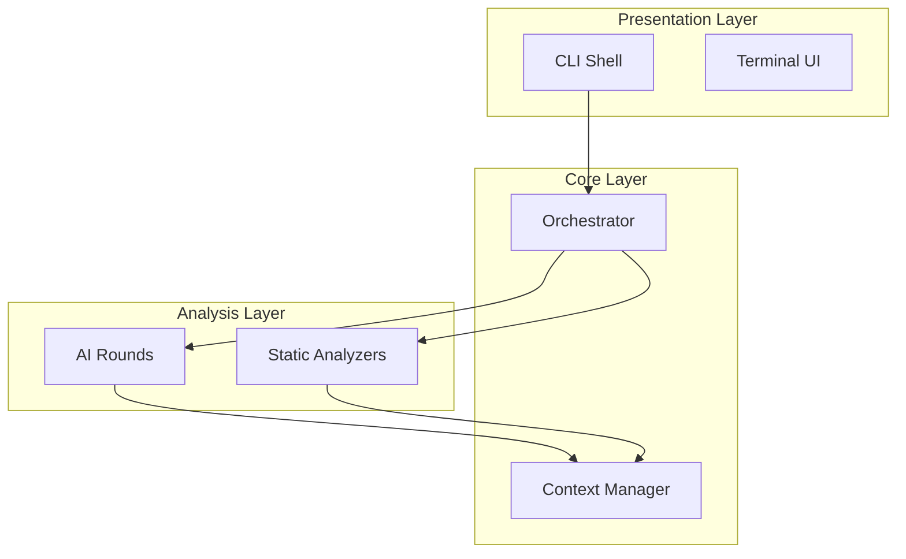

# Phase 6: Document Synthesis - Research

**Researched:** 2026-02-17
**Domain:** Markdown document rendering from structured AI/static analysis data
**Confidence:** HIGH

## Summary

Phase 6 transforms the structured outputs of 6 AI analysis rounds and 8 static analyzers into 14 cross-referenced markdown documents. The rendering layer is pure data transformation -- no LLM calls, no filesystem scanning -- consuming typed `RoundExecutionResult<T>` objects and `StaticAnalysisResult` data that already exist in the pipeline's `roundResults` Map and `staticAnalysisResult` variable. The current codebase already has a placeholder `render` step in the DAG (id: `'render'`, deps: `['ai-round-4', 'ai-round-5', 'ai-round-6']`) that needs to be replaced with 14+ individual render steps, each declaring only the rounds it actually needs.

The primary technical challenge is mapping the 14 documents to their data sources (some documents need only static data, some need one AI round, some need several), implementing the `--only` flag to skip unnecessary AI rounds, and building a cross-reference system that generates valid relative-path links between documents. The `yaml` library (already a dependency at `^2.7.0`) provides `YAML.stringify()` for front-matter generation. Mermaid diagrams are plain text blocks embedded in markdown fenced code blocks -- no runtime dependency needed, just correct syntax generation.

**Primary recommendation:** Build 14 independent renderer functions (one per document), a shared rendering utilities module (YAML front-matter, cross-references, audience mode, mermaid helpers), a document registry mapping aliases to renderers and their round dependencies, and integrate into the existing DAG by replacing the single `render` placeholder with individual render steps.

<user_constraints>

## User Constraints (from CONTEXT.md)

### Locked Decisions

#### Document voice & audience
- Configurable audience mode: `human` (default) or `ai`
- Config file key `audience: human | ai` sets default; CLI flag `--audience ai` overrides per run
- Human mode: guided narrative -- each section has a 1-2 sentence intro explaining WHY it matters, then the structured data
- AI mode: keeps human prose but adds machine-readable structured blocks (key-value summaries, structured metadata) for easy parsing and RAG ingestion

#### Mermaid diagrams
- Diagrams included in 4 documents: Architecture (03), Features (05), Modules (06), Dependencies (07)
- Diagram type chosen per document by Claude (flowcharts, graphs, sequence diagrams -- whatever fits best)
- Complexity: detailed where useful (up to ~20 nodes for architecture), simpler for others
- Placement: dedicated "Diagrams" section at the end of each document, not inline

#### Degraded content handling
- INDEX document (00-INDEX.md) shows status per document (complete, partial, static-only)
- Strategy for failed/degraded rounds: Claude's discretion -- optimize for most accurate outcome for the user
- Quality indicators and whether to generate empty docs: Claude's discretion -- prioritize usefulness over completeness

#### Selective generation (--only)
- Short name aliases: `arch`, `features`, `deps`, `env`, `modules`, etc.
- Group aliases for common sets: e.g., `--only core` (arch+modules+features), `--only ops` (env+deploy+deps)
- Only run AI rounds needed for selected documents -- skip unnecessary rounds to save cost
- Cross-references to non-generated documents kept as-is -- they resolve when user generates all docs

### Claude's Discretion
- Exact document section ordering within each file
- YAML front-matter field selection
- Which diagram type per document (flowchart, graph, sequence)
- Degraded content strategy (warning banners vs. omission vs. static fallback)
- Whether to generate a document when its primary AI round completely failed
- Per-section confidence indicators (if any)
- Exact short name aliases and group compositions for --only
- Groups for --only should cover common use cases (quick onboarding subset, ops/deploy subset)

### Deferred Ideas (OUT OF SCOPE)
None -- discussion stayed within phase scope

</user_constraints>

## Standard Stack

### Core

| Library | Version | Purpose | Why Standard |
|---------|---------|---------|--------------|
| `yaml` | ^2.7.0 | YAML front-matter serialization | Already a project dependency. `YAML.stringify()` produces clean YAML strings from JS objects. Used for front-matter blocks. |
| `node:fs/promises` | built-in | Write rendered markdown files to disk | Standard Node.js, already used throughout the codebase (see `generate.ts`). |
| `node:path` | built-in | Path resolution for output directory and cross-references | Standard Node.js, already used throughout the codebase. |
| `zod` | ^3.24.0 | Validate renderer input data, define document registry schema | Already a project dependency. Consistent with codebase pattern of Zod-everywhere. |

### Supporting

| Library | Version | Purpose | When to Use |
|---------|---------|---------|-------------|
| `picocolors` | ^1.1.0 | Terminal output during rendering (step progress) | Already a dependency. Used for render step logging. |

### What We Do NOT Need

| Concern | Why No Library |
|---------|---------------|
| Mermaid rendering | Mermaid diagrams are plain text in fenced code blocks (```` ```mermaid ````). GitHub, VS Code, and documentation tools render them natively. We only generate the text syntax. |
| Markdown templating (Handlebars, EJS, etc.) | The architecture research suggested Handlebars templates, but the actual codebase uses programmatic string building (see `report.ts` with `lines.push()`). Stay consistent -- use the same pattern. |
| Markdown parsing/validation | Cross-references are generated by the renderers themselves, not parsed from arbitrary markdown. No need for a markdown AST library. |

**Installation:** No new dependencies needed. All required libraries are already in `package.json`.

## Architecture Patterns

### Recommended Project Structure

```
src/
├── renderers/
│   ├── types.ts              # RenderContext, DocumentMeta, RenderResult types
│   ├── registry.ts           # Document registry: alias mapping, round dependencies, renderer lookup
│   ├── utils.ts              # Shared: buildFrontMatter(), crossRef(), codeRef(), sectionIntro()
│   ├── mermaid.ts            # Mermaid diagram builders per document type
│   ├── audience.ts           # Audience mode logic (human vs ai block generation)
│   ├── render-00-index.ts    # 00-INDEX.md renderer
│   ├── render-01-overview.ts # 01-PROJECT-OVERVIEW.md renderer
│   ├── render-02-getting-started.ts
│   ├── render-03-architecture.ts
│   ├── render-04-file-structure.ts
│   ├── render-05-features.ts
│   ├── render-06-modules.ts
│   ├── render-07-dependencies.ts
│   ├── render-08-environment.ts
│   ├── render-09-edge-cases.ts
│   ├── render-10-tech-debt.ts
│   ├── render-11-conventions.ts
│   ├── render-12-testing.ts
│   └── render-13-deployment.ts
```

### Pattern 1: Document Registry with Dependency Declaration

**What:** A central registry maps each document to its short aliases, required AI rounds, required static data, and renderer function. The `--only` flag resolves aliases through this registry, and the registry determines which AI rounds to skip.

**When to use:** When you need to selectively generate documents and skip unused AI rounds to save cost.

**Example:**

```typescript
// Source: Derived from existing codebase patterns (generate.ts step registration)

interface DocumentSpec {
  id: string;                    // e.g., '00-index'
  filename: string;              // e.g., '00-INDEX.md'
  aliases: string[];             // e.g., ['index', 'idx']
  requiredRounds: number[];      // e.g., [1, 2, 3, 4, 5, 6] for INDEX
  render: (ctx: RenderContext) => string;
}

const DOCUMENT_REGISTRY: DocumentSpec[] = [
  {
    id: '00-index',
    filename: '00-INDEX.md',
    aliases: ['index', 'idx'],
    requiredRounds: [],  // INDEX only needs the other docs' results
    render: renderIndex,
  },
  {
    id: '03-architecture',
    filename: '03-ARCHITECTURE.md',
    aliases: ['arch', 'architecture'],
    requiredRounds: [1, 2, 3, 4],  // R4 depends on R1-R3
    render: renderArchitecture,
  },
  // ...
];

// Group aliases expand to document sets
const GROUP_ALIASES: Record<string, string[]> = {
  core: ['arch', 'modules', 'features'],
  ops: ['env', 'deploy', 'deps'],
  onboard: ['overview', 'getting-started', 'arch', 'file-structure'],
  quality: ['edge-cases', 'tech-debt', 'testing', 'conventions'],
};
```

### Pattern 2: RenderContext as Unified Data Bag

**What:** Each renderer receives a single `RenderContext` object containing all available data (round results, static analysis, config, audience mode). Renderers pick what they need. This avoids complex function signatures and makes it easy to add new data sources.

**When to use:** When renderers need different subsets of the same pool of data.

**Example:**

```typescript
// Source: Derived from existing codebase patterns (RoundExecutionResult, StaticAnalysisResult)

interface RenderContext {
  // AI round results (may be undefined if round was skipped/failed)
  rounds: {
    r1?: RoundExecutionResult<Round1Output>;
    r2?: RoundExecutionResult<Round2Output>;
    r3?: RoundExecutionResult<Round3Output>;
    r4?: RoundExecutionResult<Round4Output>;
    r5?: RoundExecutionResult<Round5Output>;
    r6?: RoundExecutionResult<Round6Output>;
  };
  // Static analysis (always available)
  staticAnalysis: StaticAnalysisResult;
  // Configuration
  config: HandoverConfig;
  // Rendering options
  audience: 'human' | 'ai';
  // Generated at timestamp
  generatedAt: string;
  // Project name (from R1 or config)
  projectName: string;
}
```

### Pattern 3: Programmatic String Building (Consistent with Codebase)

**What:** Build markdown via `lines: string[]` and `lines.push()`, joining with `\n` at the end. This is the exact pattern used in `src/analyzers/report.ts` (the existing markdown report generator).

**When to use:** For all document rendering. Do NOT introduce a template engine -- it would be inconsistent with the existing codebase.

**Example:**

```typescript
// Source: src/analyzers/report.ts (existing codebase pattern)

function renderArchitecture(ctx: RenderContext): string {
  const lines: string[] = [];

  // YAML front-matter
  lines.push(buildFrontMatter({
    title: '03 - Architecture',
    category: 'architecture',
    generatedAt: ctx.generatedAt,
    audience: ctx.audience,
  }));

  // 2-sentence RAG summary (DOC-17)
  lines.push('# Architecture');
  lines.push('');
  lines.push(buildSummary(ctx, 'architecture'));
  lines.push('');

  // Sections with audience-aware intros
  if (ctx.rounds.r4?.data.patterns.length) {
    lines.push('## Architecture Patterns');
    if (ctx.audience === 'human') {
      lines.push('');
      lines.push('These are the dominant architecture patterns identified in the codebase, each backed by concrete code evidence.');
    }
    // ... render pattern data
  }

  // Mermaid diagrams section at the END (locked decision)
  lines.push('## Diagrams');
  lines.push('');
  lines.push(buildArchitectureDiagram(ctx));

  return lines.join('\n');
}
```

### Pattern 4: YAML Front-Matter via `yaml` Library

**What:** Use the already-installed `yaml` package's `stringify()` to produce the front-matter block. Wrap with `---` delimiters.

**Example:**

```typescript
// Source: Context7 /eemeli/yaml documentation (verified HIGH confidence)

import { stringify } from 'yaml';

function buildFrontMatter(meta: Record<string, unknown>): string {
  const yamlBlock = stringify(meta).trimEnd();
  return `---\n${yamlBlock}\n---\n`;
}

// Usage:
buildFrontMatter({
  title: '03 - Architecture',
  category: 'architecture',
  generatedAt: '2026-02-17T10:30:00Z',
  audience: 'human',
  project: 'handover',
  documents: 14,
})
// Output:
// ---
// title: 03 - Architecture
// category: architecture
// generatedAt: "2026-02-17T10:30:00Z"
// audience: human
// project: handover
// documents: 14
// ---
```

### Pattern 5: Mermaid Diagrams as Plain Text Blocks

**What:** Generate mermaid diagram syntax as string content inside fenced code blocks. No runtime dependency. GitHub, VS Code, and documentation platforms render these natively.

**Example:**

```typescript
// Source: Context7 /mermaid-js/mermaid documentation (verified HIGH confidence)

function buildModuleDependencyDiagram(
  modules: Round2Output['modules'],
  relationships: Round2Output['relationships'],
): string {
  const lines: string[] = [];
  lines.push('```mermaid');
  lines.push('graph LR');

  // Nodes
  for (const mod of modules.slice(0, 15)) {
    const safeId = mod.name.replace(/[^a-zA-Z0-9]/g, '_');
    lines.push(`  ${safeId}["${mod.name}"]`);
  }

  // Edges
  for (const rel of relationships) {
    const fromId = rel.from.replace(/[^a-zA-Z0-9]/g, '_');
    const toId = rel.to.replace(/[^a-zA-Z0-9]/g, '_');
    lines.push(`  ${fromId} -->|${rel.type}| ${toId}`);
  }

  lines.push('```');
  return lines.join('\n');
}
```

### Anti-Patterns to Avoid

- **Template engine for markdown:** The codebase uses `lines.push()` pattern exclusively (see `report.ts`). Introducing Handlebars/EJS would create an inconsistent pattern and add a dependency for no benefit.
- **Single monolithic render function:** Each document has different data needs and structure. One massive function would be unmaintainable. Use one function per document.
- **Rendering all documents in a single DAG step:** This prevents `--only` from skipping AI rounds. Each document should be its own DAG step (or at minimum, the decision of which documents to render should happen before the DAG builds its step list).
- **Inline mermaid diagrams scattered through sections:** Locked decision -- diagrams go in a dedicated "Diagrams" section at the end of each applicable document.
- **Generating empty/meaningless documents:** When a round completely fails, a document with only "AI analysis unavailable" is worse than no document. Generate documents with whatever data IS available (static fallback), but skip generation entirely if there's genuinely nothing useful to show.

## Document-to-Data Source Mapping

This is the critical mapping that drives both the rendering logic and the `--only` optimization.

### Round Dependencies per Document

| Document | Filename | Primary Rounds | Static Data Used | Can Render Static-Only? |
|----------|----------|---------------|------------------|------------------------|
| 00-INDEX | 00-INDEX.md | None (meta) | All docs' existence | Yes (always) |
| 01-OVERVIEW | 01-PROJECT-OVERVIEW.md | R1 | fileTree, deps, git, docs | Yes (basic) |
| 02-GETTING-STARTED | 02-GETTING-STARTED.md | R1, R6 | deps, env, docs | Yes (basic) |
| 03-ARCHITECTURE | 03-ARCHITECTURE.md | R4 (needs R1-R3) | ast, fileTree | No (needs AI) |
| 04-FILE-STRUCTURE | 04-FILE-STRUCTURE.md | R1, R2 | fileTree, ast | Yes (annotated tree) |
| 05-FEATURES | 05-FEATURES.md | R3 (needs R1-R2) | ast | No (needs AI) |
| 06-MODULES | 06-MODULES.md | R2 (needs R1) | ast, fileTree | Partial (dirs only) |
| 07-DEPENDENCIES | 07-DEPENDENCIES.md | R1 | deps | Yes (list only) |
| 08-ENVIRONMENT | 08-ENVIRONMENT.md | R6 (needs R1-R2) | env | Yes (vars only) |
| 09-EDGE-CASES | 09-EDGE-CASES-AND-GOTCHAS.md | R5 (needs R1-R2) | todos | Partial (TODOs only) |
| 10-TECH-DEBT | 10-TECH-DEBT-AND-TODOS.md | R5 (needs R1-R2) | todos | Yes (TODO scan) |
| 11-CONVENTIONS | 11-CONVENTIONS.md | R5 (needs R1-R2) | ast | No (needs AI) |
| 12-TESTING | 12-TESTING-STRATEGY.md | R5 (needs R1-R2) | tests | Yes (basic) |
| 13-DEPLOYMENT | 13-DEPLOYMENT.md | R6 (needs R1-R2) | env, deps, fileTree | Partial (CI detection) |

### AI Round Dependency Chain

This is the existing DAG structure from `generate.ts`:

```
static-analysis
  └─> ai-round-1
       └─> ai-round-2
            ├─> ai-round-3 ──> ai-round-4
            ├─> ai-round-5
            └─> ai-round-6
```

### Recommended --only Aliases and Groups

**Individual aliases (Claude's discretion recommendation):**

| Alias | Document |
|-------|----------|
| `index` | 00-INDEX |
| `overview` | 01-PROJECT-OVERVIEW |
| `getting-started`, `start` | 02-GETTING-STARTED |
| `arch`, `architecture` | 03-ARCHITECTURE |
| `files`, `file-structure` | 04-FILE-STRUCTURE |
| `features` | 05-FEATURES |
| `modules`, `mods` | 06-MODULES |
| `deps`, `dependencies` | 07-DEPENDENCIES |
| `env`, `environment` | 08-ENVIRONMENT |
| `edge-cases`, `gotchas` | 09-EDGE-CASES-AND-GOTCHAS |
| `tech-debt`, `todos` | 10-TECH-DEBT-AND-TODOS |
| `conventions` | 11-CONVENTIONS |
| `testing`, `tests` | 12-TESTING-STRATEGY |
| `deploy`, `deployment` | 13-DEPLOYMENT |

**Group aliases (Claude's discretion recommendation):**

| Group | Expands To | Use Case |
|-------|-----------|----------|
| `core` | arch, modules, features | Core architecture understanding |
| `ops` | env, deploy, deps | Operational/deployment knowledge |
| `onboard` | overview, getting-started, arch, file-structure | Quick new-developer onboarding |
| `quality` | edge-cases, tech-debt, testing, conventions | Code quality assessment |
| `all` | All 14 documents | Full generation (default) |

## --only Round Skipping Logic

When `--only` is specified, compute the minimal set of AI rounds needed:

```typescript
// 1. Resolve aliases to document IDs
// 2. Collect requiredRounds from each selected document
// 3. Expand round dependencies (e.g., R4 needs R1+R2+R3)
// 4. Build DAG with only those rounds + their dependencies

function computeRequiredRounds(selectedDocs: DocumentSpec[]): Set<number> {
  const needed = new Set<number>();
  for (const doc of selectedDocs) {
    for (const round of doc.requiredRounds) {
      needed.add(round);
    }
  }
  // Expand dependencies: R4 needs R3, R3 needs R1+R2, etc.
  // The DAG handles this naturally -- if we don't register a round step,
  // it won't run. We just need to register steps for the needed rounds
  // plus their transitive deps.
  return expandRoundDeps(needed);
}

const ROUND_DEPS: Record<number, number[]> = {
  1: [],
  2: [1],
  3: [1, 2],
  4: [1, 2, 3],
  5: [1, 2],
  6: [1, 2],
};
```

## Config Schema Extension

The `audience` config key needs to be added to `HandoverConfigSchema`:

```typescript
// In src/config/schema.ts -- add to HandoverConfigSchema:
audience: z.enum(['human', 'ai']).default('human'),
```

The CLI `--audience` flag needs to be added to the `generate` command in `src/cli/index.ts`:

```typescript
.option('--audience <mode>', 'Audience mode: human (default) or ai')
```

## Audience Mode Implementation

### Human Mode (default)
- Each section opens with 1-2 sentences explaining WHY this information matters
- Data is presented in readable tables and lists
- Cross-references use descriptive link text

### AI Mode
- Keeps all human-readable prose
- Adds structured metadata blocks after each section for machine parsing:

```markdown
## Module: Authentication

This module handles user authentication and session management...

<!-- ai:structured -->
```yaml
module: authentication
path: src/auth
purpose: user authentication and session management
public_api: [login, logout, refreshToken, validateSession]
files: 12
complexity: medium
```
<!-- /ai:structured -->
```

The `<!-- ai:structured -->` comment blocks are invisible in rendered markdown but parseable by RAG systems. This avoids duplicating content -- the same document works for both humans and machines.

## Cross-Reference System

### Implementation

Cross-references use standard markdown relative links with anchors:

```markdown
See [Architecture Patterns](./03-ARCHITECTURE.md#architecture-patterns) for how these modules interact.
```

### Cross-Reference Builder

```typescript
function crossRef(
  targetDoc: string,     // e.g., '03-ARCHITECTURE'
  anchor?: string,       // e.g., 'architecture-patterns'
  linkText?: string,     // e.g., 'Architecture Patterns'
): string {
  const filename = `${targetDoc}.md`;
  const anchorPart = anchor ? `#${anchor}` : '';
  const text = linkText ?? targetDoc.replace(/^\d+-/, '').replace(/-/g, ' ');
  return `[${text}](${filename}${anchorPart})`;
}
```

### Cross-Reference Strategy (per locked decision)
- Cross-references to non-generated documents are kept as-is -- they will resolve when the user generates all docs
- No broken-link validation needed for `--only` partial generation
- Each document should include cross-references to related documents where context helps

## Degraded Content Strategy (Claude's Discretion Recommendation)

### When AI round succeeds: Full rendering
All sections populated from AI data, supplemented by static analysis.

### When AI round is degraded (static fallback data): Partial rendering with warning banner

```markdown
> **Note:** AI analysis for this section was unavailable. Content is based on static analysis only and may be incomplete.
```

Generate the document with whatever static data is available. The fallback data structures already exist in `src/ai-rounds/fallbacks.ts` and produce typed `RoundXOutput` objects.

### When AI round is completely failed/skipped: Conditional generation

- If the document has useful static-only content (e.g., 10-TECH-DEBT from TodoScanner, 07-DEPS from dependency manifests): generate it with a warning banner
- If the document has no meaningful static content (e.g., 05-FEATURES without R3, 11-CONVENTIONS without R5): skip generation entirely, mark as "not generated" in INDEX

### INDEX document status indicators

```markdown
| # | Document | Status |
|---|----------|--------|
| 01 | [Project Overview](01-PROJECT-OVERVIEW.md) | Complete |
| 03 | [Architecture](03-ARCHITECTURE.md) | Partial (static analysis only) |
| 05 | Features | Not generated (AI analysis required) |
```

## YAML Front-Matter Fields (Claude's Discretion Recommendation)

```yaml
---
title: "03 - Architecture"
document_id: "03-architecture"
category: architecture        # One of: index, overview, guide, architecture, structure, features, modules, dependencies, environment, edge-cases, tech-debt, conventions, testing, deployment
project: "{projectName}"
generated_at: "2026-02-17T10:30:00Z"
handover_version: "0.1.0"
audience: human               # human | ai
ai_rounds_used: [1, 2, 3, 4] # Which rounds contributed
status: complete              # complete | partial | static-only
---
```

## Mermaid Diagram Types (Claude's Discretion Recommendation)

| Document | Recommended Diagram Type | Rationale |
|----------|------------------------|-----------|
| 03-ARCHITECTURE | `flowchart TD` (top-down) | Architecture layers flow top-to-bottom; subgraphs group layers. Up to ~20 nodes. |
| 05-FEATURES | `flowchart LR` (left-right) | Feature flows read left-to-right as data flows through modules. Simpler, ~10 nodes. |
| 06-MODULES | `graph LR` | Module dependency graph shows relationships between bounded contexts. ~10-15 nodes. |
| 07-DEPENDENCIES | `graph TD` | Dependency tree with production/dev grouping via subgraphs. ~15 nodes. |

### Mermaid Syntax Reference (Verified via Context7)



Key syntax rules:
- Node IDs must be alphanumeric (sanitize with `.replace(/[^a-zA-Z0-9_]/g, '_')`)
- Labels in `["quotes"]` support spaces and special characters
- Subgraphs group related nodes
- Edge labels: `-->|label text|`
- Direction: `TD` (top-down), `LR` (left-right), `BT` (bottom-top), `RL` (right-left)

## Don't Hand-Roll

| Problem | Don't Build | Use Instead | Why |
|---------|-------------|-------------|-----|
| YAML serialization | Custom key-value string builder | `yaml` package `stringify()` | Already a dependency. Handles quoting, escaping, nested objects, arrays correctly. |
| Markdown table generation | Manual string concatenation | Small utility function wrapping `lines.push()` | Tables have alignment edge cases (pipe escaping, column width). Build one helper, reuse everywhere. |
| Mermaid rendering | Any runtime mermaid dependency | Plain text in fenced code blocks | GitHub/VS Code/docs tools render natively. We only produce the text. |
| File path sanitization for cross-refs | Ad-hoc string replacements | Centralized `crossRef()` utility | Anchor generation, relative path resolution, and consistent link text format are easy to get wrong in 14 separate renderers. |

**Key insight:** The renderers are pure functions: data in, string out. There is no I/O, no async, no side effects in the rendering itself. Only the final `writeFile()` call needs to be async. This makes testing trivial -- call the function, assert against the output string.

## Common Pitfalls

### Pitfall 1: Inconsistent Code References

**What goes wrong:** Some renderers use `src/auth/middleware.ts` while others use `middleware.ts` or `./src/auth/middleware.ts`. DOC-18 requires full paths with line numbers.
**Why it happens:** Code references come from different data sources (AI rounds use one format, static analysis another, AST data yet another).
**How to avoid:** Build a centralized `codeRef(file: string, line?: number)` utility that normalizes all file paths to full relative paths (from project root) with optional `:L{line}` suffix. All renderers MUST use this utility.
**Warning signs:** Any renderer that concatenates file paths manually instead of calling `codeRef()`.

### Pitfall 2: Mermaid Syntax Errors from Unsafe Node IDs

**What goes wrong:** Module names like `@auth/core` or `src/utils` contain characters (`@`, `/`) that break mermaid graph syntax.
**Why it happens:** Module names and file paths come directly from AI/static data and are used as mermaid node identifiers.
**How to avoid:** Always sanitize node IDs: `name.replace(/[^a-zA-Z0-9_]/g, '_')`. Use the full name only in the label: `sanitized["Original Name"]`.
**Warning signs:** Mermaid diagrams that don't render in GitHub preview.

### Pitfall 3: --only Flag Doesn't Actually Skip Rounds

**What goes wrong:** `--only deps` still runs all 6 AI rounds because the DAG is built before considering `--only`.
**Why it happens:** The current `generate.ts` builds all steps unconditionally, then runs the DAG. The `--only` flag (currently unused) needs to influence step registration.
**How to avoid:** Parse `--only` early, compute required rounds from the document registry, and conditionally register only needed AI round steps + render steps in the DAG.
**Warning signs:** Token usage/cost is the same regardless of `--only` value.

### Pitfall 4: Cross-References Break with --only

**What goes wrong:** `03-ARCHITECTURE.md` contains `[See Modules](06-MODULES.md#boundary-analysis)` but the user ran `--only arch` so `06-MODULES.md` doesn't exist.
**Why it happens:** Renderers generate cross-references to all related documents regardless of what's being generated.
**How to avoid:** Per locked decision -- keep cross-references as-is. They resolve when the user generates all docs. This is the correct behavior.
**Warning signs:** N/A (this is expected and documented behavior).

### Pitfall 5: Large Diagrams Becoming Unreadable

**What goes wrong:** A project with 50 modules produces a mermaid graph with 50 nodes and 200 edges that renders as an unreadable mess.
**Why it happens:** Rendering all available data without any filtering or grouping.
**How to avoid:** Cap diagram complexity. Architecture: up to ~20 nodes (group minor modules into "Other" subgraphs). Dependencies: top 15 by criticality. Features: top 10 by module count. Always provide the full data in text form outside the diagram.
**Warning signs:** Mermaid diagrams with more than 25 nodes.

### Pitfall 6: Missing Audience Mode Check

**What goes wrong:** AI mode blocks are generated in human mode or vice versa, or the `audience` config option is ignored.
**Why it happens:** Renderers forget to check `ctx.audience` before adding structured blocks.
**How to avoid:** The audience mode check should happen in shared utilities (`sectionIntro()`, `structuredBlock()`), not in each renderer individually. Renderers call the utility, the utility checks the mode.
**Warning signs:** Any renderer that directly checks `ctx.audience` instead of using the shared utility.

## Code Examples

### YAML Front-Matter Generation

```typescript
// Source: Context7 /eemeli/yaml (HIGH confidence)
import { stringify } from 'yaml';

interface FrontMatterFields {
  title: string;
  document_id: string;
  category: string;
  project: string;
  generated_at: string;
  handover_version: string;
  audience: 'human' | 'ai';
  ai_rounds_used: number[];
  status: 'complete' | 'partial' | 'static-only';
}

function buildFrontMatter(fields: FrontMatterFields): string {
  return `---\n${stringify(fields).trimEnd()}\n---\n`;
}
```

### Code Reference Utility

```typescript
// Ensures DOC-18 compliance: full paths e.g., src/auth/middleware.ts:L42
function codeRef(file: string, line?: number): string {
  // Normalize path: remove leading ./ or /
  const normalized = file.replace(/^\.?\//, '');
  return line ? `\`${normalized}:L${line}\`` : `\`${normalized}\``;
}
```

### Cross-Reference Utility

```typescript
// Ensures DOC-15 compliance: relative paths with anchors
function crossRef(docId: string, anchor?: string, text?: string): string {
  const filename = `${docId}.md`;
  const anchorPart = anchor ? `#${anchor}` : '';
  const displayText = text ?? docId.replace(/^\d+-/, '').replace(/-/g, ' ');
  return `[${displayText}](${filename}${anchorPart})`;
}
```

### Section Intro (Audience-Aware)

```typescript
function sectionIntro(audience: 'human' | 'ai', humanText: string): string {
  // Human mode: include the narrative intro
  // AI mode: still include it (locked decision: AI mode keeps human prose)
  return humanText;
}

function structuredBlock(
  audience: 'human' | 'ai',
  data: Record<string, unknown>,
): string {
  if (audience !== 'ai') return '';

  // AI mode: add machine-readable block
  const yamlContent = stringify(data).trimEnd();
  return `\n<!-- ai:structured -->\n\`\`\`yaml\n${yamlContent}\n\`\`\`\n<!-- /ai:structured -->\n`;
}
```

### Document Status Tracking for INDEX

```typescript
interface DocumentStatus {
  id: string;
  filename: string;
  title: string;
  status: 'complete' | 'partial' | 'static-only' | 'not-generated';
  reason?: string;
}

function determineDocStatus(
  docSpec: DocumentSpec,
  roundResults: Map<number, RoundExecutionResult<unknown>>,
  wasGenerated: boolean,
): DocumentStatus {
  if (!wasGenerated) {
    return { ...base, status: 'not-generated', reason: 'Not included in --only selection' };
  }

  const allRoundsSucceeded = docSpec.requiredRounds.every(
    (r) => roundResults.get(r)?.status === 'success' || roundResults.get(r)?.status === 'retried',
  );

  if (allRoundsSucceeded) return { ...base, status: 'complete' };

  const anyRoundAvailable = docSpec.requiredRounds.some(
    (r) => roundResults.has(r),
  );

  if (anyRoundAvailable) return { ...base, status: 'partial' };
  return { ...base, status: 'static-only' };
}
```

## DAG Integration

### Replacing the Placeholder

The current placeholder in `generate.ts`:

```typescript
// Step 8: Document Rendering (placeholder for Phase 6)
createStep({
  id: 'render',
  name: 'Document Rendering',
  deps: ['ai-round-4', 'ai-round-5', 'ai-round-6'],
  execute: async () => {
    logger.log('Document rendering will run here (Phase 6)');
    return {};
  },
}),
```

Should be replaced with individual render steps. Two approaches:

**Approach A (Recommended): Single render step that generates multiple files**

Replace the placeholder with a single step that iterates over the document registry and generates each selected document. This is simpler and avoids 14+ DAG steps for rendering.

```typescript
createStep({
  id: 'render',
  name: 'Document Rendering',
  deps: ['ai-round-4', 'ai-round-5', 'ai-round-6'],
  execute: async () => {
    const outputDir = resolve(config.output);
    await mkdir(outputDir, { recursive: true });

    const ctx = buildRenderContext(roundResults, staticAnalysisResult, config);
    const selectedDocs = resolveSelectedDocs(options.only, DOCUMENT_REGISTRY);

    const statuses: DocumentStatus[] = [];
    for (const doc of selectedDocs) {
      const content = doc.render(ctx);
      await writeFile(join(outputDir, doc.filename), content, 'utf-8');
      statuses.push(determineDocStatus(doc, roundResults, true));
    }

    // Generate INDEX last (it needs all statuses)
    const indexContent = renderIndex(ctx, statuses);
    await writeFile(join(outputDir, '00-INDEX.md'), indexContent, 'utf-8');

    return { generatedDocs: statuses };
  },
});
```

**Approach B (Future optimization): Individual render steps per document**

Each document is a DAG step with deps on only the rounds it needs. This enables maximum parallelism (PIPE-04: "Document renders start as soon as their specific AI round dependencies complete"). However, it adds complexity and is likely premature for v1 since rendering is fast (no I/O beyond `writeFile`).

**Recommendation:** Start with Approach A. If render time becomes significant, refactor to Approach B. The document registry makes this refactoring mechanical.

### --only Integration with DAG

The `--only` logic must run BEFORE the DAG is built:

```typescript
// In generate.ts, before building steps:
const selectedDocs = resolveSelectedDocs(options.only, DOCUMENT_REGISTRY);
const requiredRounds = computeRequiredRounds(selectedDocs);

// Then only register AI round steps for rounds in requiredRounds
if (requiredRounds.has(1)) steps.push(createRound1Step(...));
if (requiredRounds.has(2)) steps.push(createRound2Step(...));
// etc.

// Update render step deps to only reference registered rounds
const renderDeps = [...requiredRounds].map(r => `ai-round-${r}`);
// But must be the LATEST round in each branch, not all rounds
// Since DAG handles transitive deps, we just need terminal rounds
```

## State of the Art

| Old Approach | Current Approach | When Changed | Impact |
|--------------|------------------|--------------|--------|
| Handlebars templates for markdown | Programmatic string building | This project's convention | Simpler, no template engine dependency, direct type safety |
| Single monolithic doc generator | Registry-based per-document renderers | Modern doc tools (Docusaurus, VitePress, etc.) | Selective generation, parallel rendering, testable units |
| Inline mermaid diagrams | Dedicated diagram sections | User decision (CONTEXT.md) | Cleaner document structure, easier to skip/update diagrams |

## Open Questions

1. **Render step dependency granularity**
   - What we know: The existing DAG has a single `render` step depending on all final AI rounds. PIPE-04 says "Document renders start as soon as their specific AI round dependencies complete."
   - What's unclear: Whether v1 needs per-document DAG steps (Approach B) or if a single render step (Approach A) is sufficient.
   - Recommendation: Start with Approach A (single step). Rendering is pure computation, not I/O-bound. Per-document steps add complexity without meaningful speedup for v1. Refactor if profiling shows render time is significant.

2. **INDEX generation timing with --only**
   - What we know: INDEX needs all document statuses. With `--only`, some documents are intentionally not generated.
   - What's unclear: Should INDEX always be generated even when not in `--only`, since it provides a status overview?
   - Recommendation: Always generate INDEX (it's cheap and provides essential context). Show non-generated documents as "Not generated" in the status table.

3. **Existing report.ts coexistence**
   - What we know: `src/analyzers/report.ts` already generates a `static-analysis.md` report with YAML front-matter and tables.
   - What's unclear: Should the Phase 6 renderers share utilities with `report.ts`, or should they be independent?
   - Recommendation: Extract shared patterns (table building, front-matter, humanSize helper) into the new `renderers/utils.ts`. The existing `report.ts` can continue working independently for `--static-only` mode.

## Sources

### Primary (HIGH confidence)
- Context7 `/eemeli/yaml` - YAML.stringify() API, front-matter generation pattern
- Context7 `/mermaid-js/mermaid` - Flowchart, graph syntax, subgraphs, node shapes, edge labels
- Codebase: `src/cli/generate.ts` - DAG pipeline structure, render placeholder, roundResults Map
- Codebase: `src/ai-rounds/schemas.ts` - All 6 round output types (Round1Output through Round6Output)
- Codebase: `src/ai-rounds/fallbacks.ts` - Static fallback data builders for degraded rounds
- Codebase: `src/ai-rounds/types.ts` - RoundExecutionResult, ValidationResult, QualityMetrics, PipelineValidationSummary
- Codebase: `src/analyzers/types.ts` - StaticAnalysisResult with all 8 analyzer subtypes
- Codebase: `src/analyzers/report.ts` - Existing markdown generation pattern (lines.push(), front-matter, tables)
- Codebase: `src/config/schema.ts` - HandoverConfigSchema (needs audience field addition)
- Codebase: `src/domain/schemas.ts` - All domain entity schemas
- Codebase: `src/orchestrator/dag.ts` - DAGOrchestrator class, step execution model
- Codebase: `src/orchestrator/step.ts` - createStep() factory function

### Secondary (MEDIUM confidence)
- Codebase: `.planning/research/ARCHITECTURE.md` - System architecture, synthesis module design, cross-reference builder pattern
- Codebase: `.planning/REQUIREMENTS.md` - DOC-01 through DOC-19 requirement definitions
- Codebase: `src/ai-rounds/summary.ts` - Round-to-document mapping, validation summary pattern

### Tertiary (LOW confidence)
- None

## Metadata

**Confidence breakdown:**
- Standard stack: HIGH - All libraries already in package.json, APIs verified via Context7
- Architecture: HIGH - Patterns derived directly from existing codebase conventions (report.ts, DAG, step registration)
- Document-to-round mapping: HIGH - Derived from round schemas and domain entities
- Mermaid syntax: HIGH - Verified via Context7 official mermaid-js documentation
- --only optimization: MEDIUM - Logic is sound but integration with existing DAG requires careful refactoring of generate.ts
- Audience mode: MEDIUM - Implementation pattern is clear but config schema/CLI extension is new territory for this codebase
- Pitfalls: HIGH - Derived from concrete codebase analysis and known mermaid/markdown edge cases

**Research date:** 2026-02-17
**Valid until:** 2026-03-17 (stable domain, no external dependency changes expected)
